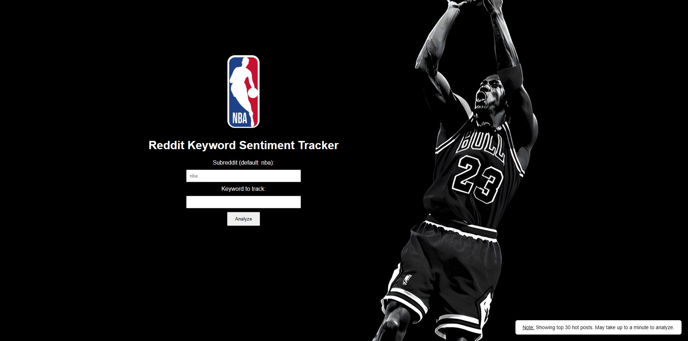
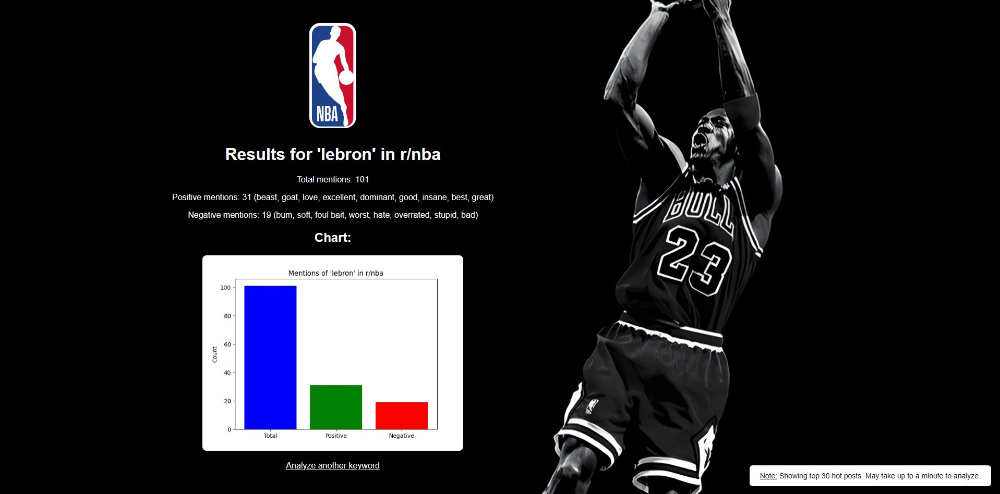

# Reddit Keyword Sentiment Tracker 

A **Flask web application** that analyzes the sentiment of a keyword on Reddit’s r/nba subreddit.  
It fetches the top 30 hot posts and all their comments, counts how often your keyword appears and shows how many mentions are positive or negative. Results are displayed as a clear chart for visualization.

---

## Screenshots of my project 

### Home Page Screenshot 


### Results Page Screenshot


---

## How to Run

**Clone this repo**

```bash
git clone https://github.com/YOUR_USERNAME/reddit-sentiment-tracker.git
cd reddit-sentiment-tracker
